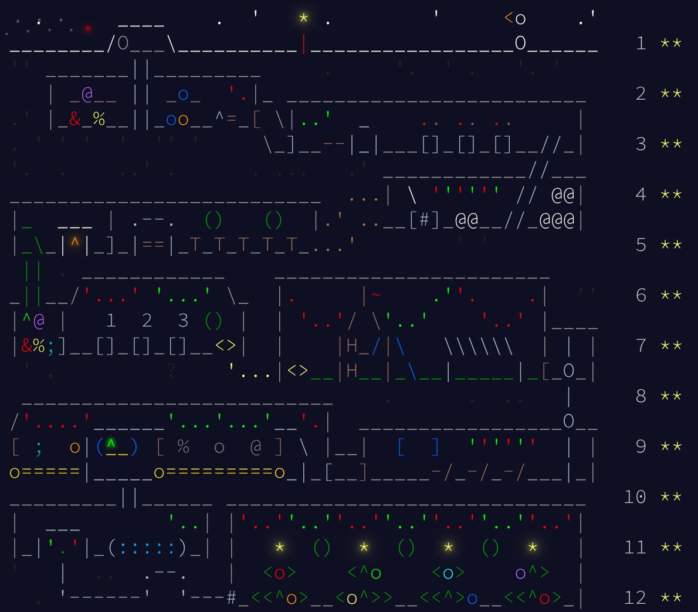

# AoC2025
AoC2025 - Advent of Code 2025  C++

Solutions for the 2025 Advent of Code in C++ (23).

## Framework

There is only one main.cpp. main.cpp links dynamicall with all implementation of days soluition.

Each single day is going to be implemented in separate cpp file, with function part1() and part2().

For (incremental) build Makefile is used.

To start a special days solution use ./bin/main -year <year> -day <day> -part <part>.

For input and output stdin and stdout are used.

Alternatively you can provide parameters -in <input file path> -out <outpu file path>.

If you are using vim, I provided a specialized vim.rc. you can use <F4> for compiling, <F5> for running and <F6> for debugging.

In order to use the vim.rc you have to use :source vim.rc.

To automatically create an empty implementation of days implementation use the script ./prepare_for_day <day>

## Solutions

Day 1 to day 10 part 1 in c++.

Day 10 part 2 to day 12 in python. 

Switched to python because for day 10 part 2 I needed a linear solver (which also can handle integer constraint properly). I wasn't able to write one on time, and also some which I tested failed. python *pulp* got it right.
